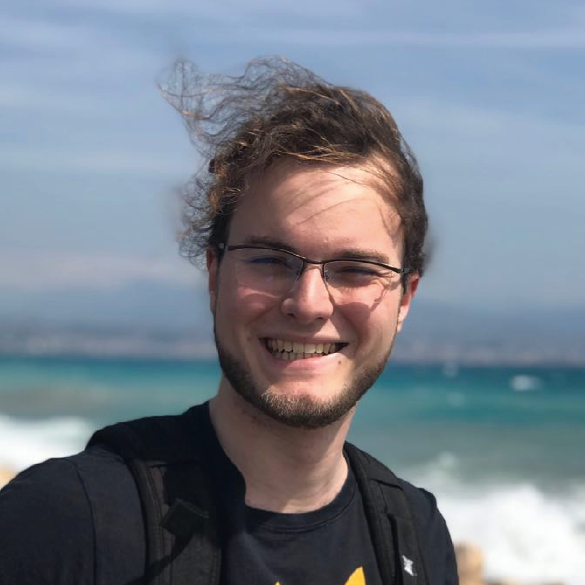
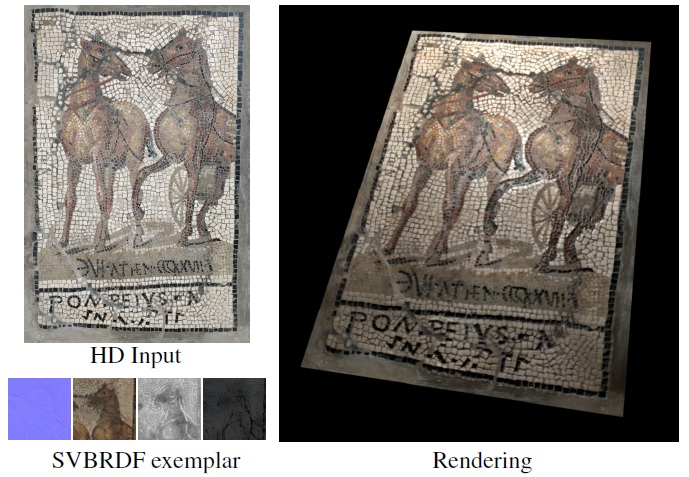
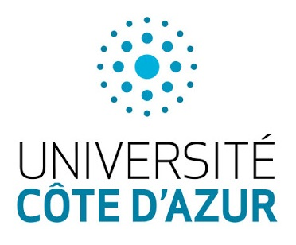
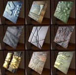
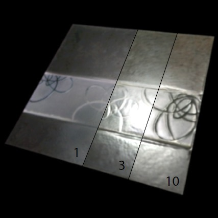
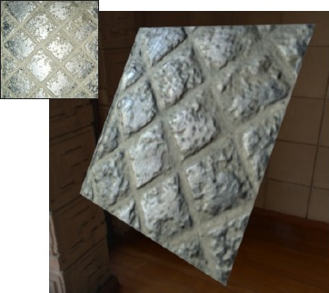
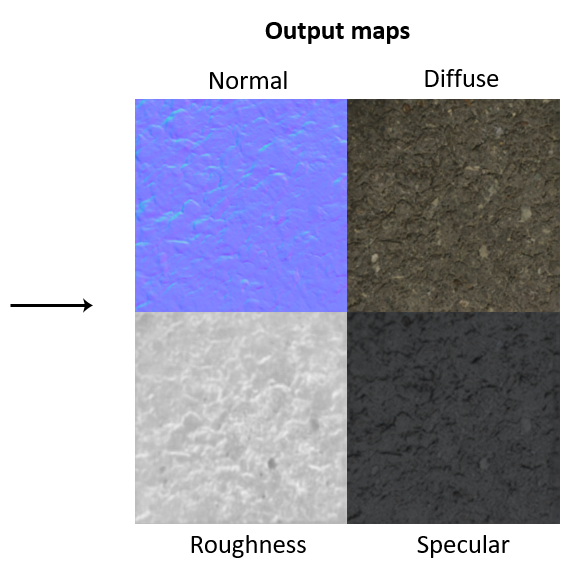

	<table width="100%">
		<tr>
			<!-- The picture -->
			<td style="text-align: left; " valign="bottom">
				
			</td>

			<!-- Name and contact -->
			<td valign="top">
				<table>
					<tr>
						<td align="center"><h1>Valentin Deschaintre</h1></td>
					</tr>
					<tr>
						<td align="center">
e-mail: <a href="mailto:v.deschaintre@imperial.ac.uk">v[dot]deschaintre[at]imperial.ac.uk</a>

							<table border="0" cellpadding="4" background-color="rgb(255, 255, 255)">
								<tr>
									<td>Realistic Graphics and Imaging 
										Imperial College London 
										Department of Computing 
										South Kensington, London, UK
									</td>
								</tr>
							</table>
						</td>
					</tr>
				</table> 
			</td>
		</tr>
	</table>
	 
	

		I am currently Associate Researcher in the <a href="http://wp.doc.ic.ac.uk/rgi/">Realistic Graphics and Imaging group</a> of Imperial College London hosted by <a href="https://www.doc.ic.ac.uk/~ghosh/">Abhijeet Ghosh</a>.
		I previously did my PhD at Inria Sophia-Antipolis in the GraphDeco research group under the supervision of <a href='https://www-sop.inria.fr/members/Adrien.Bousseau/'>Adrien Bousseau</a> and <a href='https://www-sop.inria.fr/reves/George.Drettakis'>George Drettakis</a>. 
		During my PhD, I had the pleasure to spend almost 2 months in MIT under the supervision of <a href='https://people.csail.mit.edu/fredo/'>Fr&eacute;do Durand</a>, at MIT CSAIL.   
		My research focuses on material acquisition and representation, with a particular interest in deep learning methods. But my interests also include a wider range of topics such as environment (both indoor and outdoor) Acquisition and Reconstruction, Rendering and Computational photography. Finally, while I have not had the chance to work first hand on it since my under graduate year, I am an animation enthusiat !  

		My PhD was funded by the French government (ANRT and Inria) and Optis, an Ansys affiliate using the <a href='https://www.ifsttar.fr/en/partnerships-innovation/scientific-and-technical-services/cifre-industrial-agreements-for-training-through-research/'>CIFRE</a> system of collaboration.  
		
		 I am happy to share that my  <a href="#thesis">thesis</a> was awarded the <a href = 'https://gdr-igrv.icube.unistra.fr/index.php/Prix_de_th%C3%A8se_du_GdR_IG-RV'>French Computer Graphics and Geometry Thesis award</a>! This award is delivered by the <a href="https://gdr-igrv.icube.unistra.fr/index.php/Accueil">GDR IG-RV</a> in collaboration with AFIG, AFRV and EG French chapter.
	

		<h3>Publications</h3>
	

		

			

			

		

		

			

				<a href="https://team.inria.fr/graphdeco/projects/large-scale-materials/">
					Guided Fine-Tuning for Large-Scale Material Transfer
				</a> &nbsp; 
				
				
				

			

			

				<a href='https://valentin.deschaintre.fr'>Valentin Deschaintre</a>,
				<a href='https://www-sop.inria.fr/reves/George.Drettakis'>George Drettakis</a>,
				<a href='https://www-sop.inria.fr/members/Adrien.Bousseau/'>Adrien Bousseau</a>
			

			

				Computer Graphics Forum (Eurographics Symposium on Rendering Conference Proceedings), Volume 39, Number 4 - jul 2020
			

		

		

		

			

			

		

		

			

				 <a href="https://www-sop.inria.fr/reves/Basilic/2019/Des19a/">
					Lightweight material acquisition using deep learning
				</a>
				
			

			

				<a href='https://valentin.deschaintre.fr'>Valentin Deschaintre</a>,
			

			

				Université Côté d'Azur, Inria, PhD Thesis, Nov 2019
			

		

		

		

			

			

		

		

			

				 <a href="https://www-sop.inria.fr/reves/Basilic/2019/Des19/">
					Material acquisition using deep learning
				</a>
				
				
				
			

			

				<a href='https://valentin.deschaintre.fr'>Valentin Deschaintre</a>,
			

			

				Siggraph Asia, Doctoral Consortium (Poster and Short Paper), Nov 2019
			

		

		

		

			

			

		

		

			

				<a href="https://team.inria.fr/graphdeco/projects/multi-materials/">
					Flexible SVBRDF Capture with a Multi-Image Deep Network
				</a> &nbsp; 
				
				

			

			

				<a href='https://valentin.deschaintre.fr'>Valentin Deschaintre</a>,
				<a href='https://www.csail.mit.edu/person/miika-aittala'>Miika Aittala</a>,
				<a href='https://people.csail.mit.edu/fredo/'>Fr&eacute;do Durand</a>,
				<a href='https://www-sop.inria.fr/reves/George.Drettakis'>George Drettakis</a>,
				<a href='https://www-sop.inria.fr/members/Adrien.Bousseau/'>Adrien Bousseau</a>
			

			

				Computer Graphics Forum (Eurographics Symposium on Rendering Conference Proceedings), Volume 38, Number 4, page 13 - jul 2019
			

		

		

						
		

			

			

		

		

			

				<a href="https://team.inria.fr/graphdeco/projects/deep-materials/">
					Single-Image SVBRDF Capture with a Rendering-Aware Deep Network
				</a> &nbsp; 
				
				

			

			

				<a href='https://valentin.deschaintre.fr'>Valentin Deschaintre</a>,
				<a href='https://www.csail.mit.edu/person/miika-aittala'>Miika Aittala</a>,
				<a href='https://people.csail.mit.edu/fredo/'>Fr&eacute;do Durand</a>,
				<a href='https://www-sop.inria.fr/reves/George.Drettakis'>George Drettakis</a>,
				<a href='https://www-sop.inria.fr/members/Adrien.Bousseau/'>Adrien Bousseau</a>
			

			

				ACM Transactions on Graphics (SIGGRAPH Conference Proceedings), Volume 37, Number 128, page 15 - aug 2018
			

		

		
&nbsp;

	

	
	<h3>Presentations</h3>
	

		
		

			

			

		

		
		

			

				Discussion: Research and questions in neural methods for material acquisition
				
			

			

				<a href='https://valentin.deschaintre.fr'>Valentin Deschaintre</a>,
			

			

				Workshop on Material Appearance Modeling, jul 2019
			

		

		
&nbsp;

	

	
	<h3>Academic activities</h3>
	<ul>
		<li>Reviewer for <a href="https://ieeexplore.ieee.org/xpl/RecentIssue.jsp?punumber=34">IEEE TPAMI</a></li>
		<li>Tertiary reviewer for <a href="https://sa2020.siggraph.org/en/">Siggraph Asia 2020</a></li>
		<li>Program commitee member for <a href="https://www.cvcs.no/">CVCS 2020</a></li>
		<li>Tertiary reviewer for <a href="https://s2020.siggraph.org/">Siggraph 2020</a></li>
		<li>Tertiary reviewer for <a href="https://conferences.eg.org/egev20/">Eurographics 2020</a></li>
		<li>Website administrator and volunteer <a href="https://egsr2020.london/">EGSR 2020</a></li>
		<li>Tertiary reviewer for <a href="https://sa2019.siggraph.org/">Siggraph Asia 2019</a></li>
	</ul>

