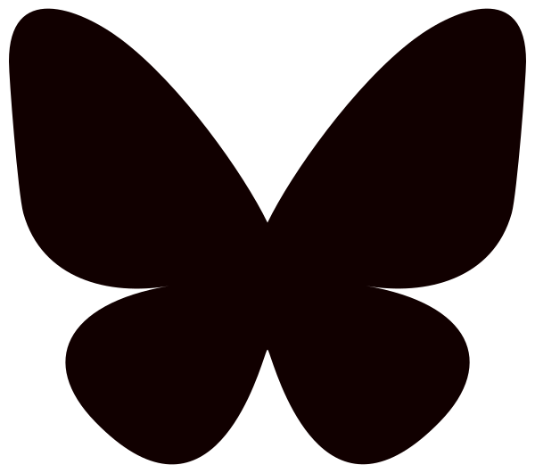

	<table width="100%">
		<tr>
			<!-- The picture -->
			<td style="text-align: left; " valign="bottom">
				
			</td>

			<!-- Name and contact -->
			<td valign="top">
				<table>
					<tr>
						<td align="center"><h1>Valentin Deschaintre</h1></td>
					</tr>
					<tr>
						<td align="center">Research Scientist - Adobe Research</td>
					</tr>
					<tr>
						<td align="center">
e-mail: <a href="mailto:deschain@adobe.com">deschain[at]a***e.com</a>

						</td>
					</tr>
					<tr>
						<td align="center">  
						</td>
					</tr>
				</table> 
			</td>
		</tr>
	</table>
	 
	

		I am currently a Research Scientist at Adobe Research in the London lab. I previously was an Associate Researcher in the <a href="http://wp.doc.ic.ac.uk/rgi/">Realistic Graphics and Imaging group</a> of Imperial College London hosted by <a href="https://www.doc.ic.ac.uk/~ghosh/">Abhijeet Ghosh</a>.
		I received my PhD at Inria Sophia-Antipolis from the GraphDeco research group under the supervision of <a href='https://www-sop.inria.fr/members/Adrien.Bousseau/'>Adrien Bousseau</a> and <a href='https://www-sop.inria.fr/reves/George.Drettakis'>George Drettakis</a> in collaboration with Optis, an Ansys affiliate. During my PhD, I spent 2 months under the supervision of <a href='https://people.csail.mit.edu/fredo/'>Fr&eacute;do Durand</a>, at MIT CSAIL.   

		My thesis received the <a href='https://gdr-igrv.fr/actions/prix-these/'>French Computer Graphics Thesis Award</a> and <a href='https://www.fondation-unica.org/'>UCA Academic Excellence Thesis Awards</a>. I was elected as <a href='https://www.eg.org/wp/junior-fellows/'>Eurographics Junior Fellow 2024</a>.  
		<b>My research currently focuses on image and 3D/appearance assets understanding, generation and authoring, with a focus on user control.</b>   
		

		

	

	<h3>Internships</h3>
	

		<b>Adobe Research Internship:</b> I will be looking for strong PhD students to collaborate with for the 2026 Adobe internship program. If you are interested in interning at Adobe with me (see my research interests above), don't hesitate to reach out (deschain@a***e.com) detailing what your research interests are, and what you would like to work on during the internship. Internships are usually discussed around November December of the year preceding it. It is important that your advisor is aware of your plans to do an intership.  	
	

	<h3>Past Interns</h3>

	

		In recent years, I was happy to act as main mentor for great students in the context of Adobe's PhD Internship program!
		<ul>
			<li><a href='https://mfischer-ucl.github.io/'>Michael Fischer (University College London): 2024</a></li>
			<li><a href='http://webdiis.unizar.es/~juliagv/'>Julia Guerrero-Viu (Universidad de Zaragoza): 2023, 2024</a></li>
			<li><a href='https://rubenwiersma.nl//'>Ruben Wiersma (Delft University): 2023</a> (now postdoc at ETH)</li>
			<li><a href='https://prafullsharma.net/'>Prafull Sharma (MIT): 2022</a> (now postdoc at MIT)</li>
			<li><a href='https://yiweihu.netlify.app/'>Yiwei Hu (Yale University): 2021, 2022</a> (Now at Adobe)</li>
		</ul>
	

	<h3>Publications</h3>
	

		
		
		

		
			
			<h2>{{thispaperyear}}</h2>

		
			

					

					

						

					

					

				

					

						<a href="{{paper.website_link}}">
							{{paper.title}}
						</a> &nbsp; 
						
						
						
						
						
						
						
						
						
						
						
						

					

					

						
						
						
							<a href='{{authorDet.website}}'>{{authorDet.name}},</a>
						
							<a href='{{authorDet.website}}'>{{authorDet.name}}</a>
						
							{{author}}
						
						
					

					
					

					<ul>
						
						<li>{{misc}}</li>
						

					</ul>
					

					

					

						{{paper.citation}}
					

				

				
				

				
					
			

		

	
 
	
	<h3>Community activities</h3>
	

	<h4>Committee member / Chair</h4>
	<ul>
	<li><a href="https://eg2024.cyens.org.cy/doctoral-consortium/">Eurographics 2024 Doctoral Consortium co-chair</a></li>
	<li><a href="https://www.eg.org/wp/junior-fellows/">Eurographics Junior Fellows chair 2025-</a></li>
	<li><a href="https://research.siggraph.org/programs/thesisff-2023/">Siggraph Thesis Fast Forward: Steering Committee, Co-chair 2023, Chair 2024</a></li>
	<li><a href="https://research.siggraph.org/">SIGGRAPH Research Career Development Committee</a></li>
	<li><a href="https://www.cvmp-conference.org/2022/">Industry Chair CVMP 2022</a> </li>
	</ul>
	<h4> Technical Program Committee member: </h4>
	<ul>
	<li><a href='https://asia.siggraph.org/2025/submissions/courses/'>Siggraph Asia Courses 2025</a></li>
	<li><a href='https://asia.siggraph.org/2023/submissions/technical-papers/'>Siggraph Asia 2023, 2024</a></li>
	<li><a href="https://eg2023.saarland-informatics-campus.de/">Eurographics 2023, 2024</a></li>
	<li><a href="https://conferences.eg.org/egsr2023/">EGSR 2021, 2022, 2023, 2025</a></li>
	<li><a href="https://www.cvcs.no/">CVCS 2020</a></li>
	</ul>
	<h4>Reviewer</h4>
	<ul>
		<li>Conferences
			<ul>
			<li><a href="https://s2022.siggraph.org/">Siggraph 2020, 2021, 2022, 2023, 2024, 2025</a></li>
			<li><a href="https://sa2020.siggraph.org/">Siggraph Asia 2019, 2020, 2021, 2022</a></li>
			<li><a href="https://conferences.eg.org/eg2021/">Eurographics 2020, 2021, 2022, 2025</a></li>
			<li><a href="https://cvpr2024.thecvf.com/">CVPR 2022, 2023, 2024, 2025</a></li>
			<li><a href="https://iccv2021.thecvf.com/home">ICCV 2021, 2025</a></li>
			</ul>
		</li>
		<li>Journals
			<ul>
			<li><a href="https://dl.acm.org/journal/tog">ACM Transactions On Graphics</a></li>
			<li><a href="https://www.computer.org/csdl/journal/tg">IEEE Transactions on Visualization and Computer Graphics</a></li>
			<li><a href="https://onlinelibrary.wiley.com/journal/14678659">Computer Graphics Forum</a></li>
			<li><a href="https://ieeexplore.ieee.org/xpl/RecentIssue.jsp?punumber=34">IEEE Transactions on Pattern Analysis and Machine Intelligence</a></li>
			<li><a href="https://www.journals.elsevier.com/graphics-and-visual-computing">Graphics and Visual Computing</a></li>
			</ul>
		</li>
	</ul>
	<h4>Others</h4>
	<ul>
		<li>Website administrator and volunteer <a href="https://egsr2020.london/">EGSR 2020</a></li>
	</ul>
	

